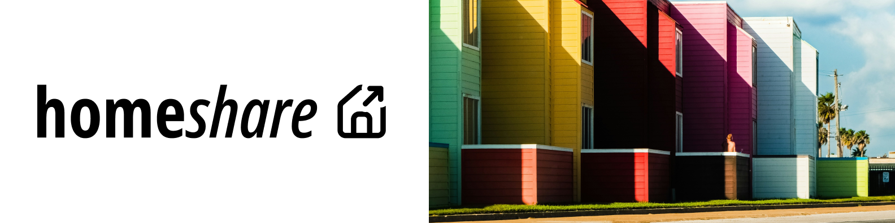

    
     
     
    <b>homeshare</b> is a cross-platform application that helps people find housing with other people they relate to.
     
     

# Technologies
This project was developed with a combination of modern technologies:
### The Frontend

### The Server & Backend

### Machine Learning

---
 

This monorepo contains all code for the frontend, backend, and Machine Learning models. 

## Navigate
- Frontend [README]()
- Backend [README](./backend/README.md)
- Machine Learning [README]()